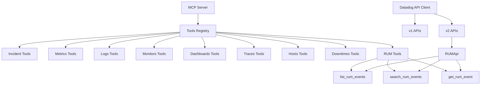

# Plan for Adding Datadog RUM Tool to MCP Server

Based on my analysis of the codebase and your requirements, I'll create a detailed plan for implementing the RUM (Real User Monitoring) tool with the basic operations: list RUM events, search RUM events, and get RUM event details.

## Overview

The Datadog MCP Server follows a consistent pattern for implementing tools:

1. Each tool has its own directory under `src/tools/`
2. Each tool directory contains three files: `schema.ts`, `tool.ts`, and `index.ts`
3. The tool is registered in the main `src/index.ts` file

## Implementation Plan

### 1. Create Directory Structure

Create a new directory for the RUM tool:

```
src/tools/rum/
```

### 2. Create Schema File

Create `src/tools/rum/schema.ts` with Zod schemas for the RUM operations:

```typescript
import { z } from 'zod'

// Schema for listing RUM events
export const ListRumEventsZodSchema = z.object({
  applicationId: z.string().describe('The RUM application ID'),
  from: z.number().describe('Start time in epoch seconds'),
  to: z.number().describe('End time in epoch seconds'),
  limit: z
    .number()
    .optional()
    .default(100)
    .describe('Maximum number of events to return. Default is 100.'),
})

// Schema for searching RUM events
export const SearchRumEventsZodSchema = z.object({
  applicationId: z.string().describe('The RUM application ID'),
  query: z.string().describe('RUM events query string'),
  from: z.number().describe('Start time in epoch seconds'),
  to: z.number().describe('End time in epoch seconds'),
  limit: z
    .number()
    .optional()
    .default(100)
    .describe('Maximum number of events to return. Default is 100.'),
})

// Schema for getting RUM event details
export const GetRumEventZodSchema = z.object({
  eventId: z.string().nonempty().describe('The RUM event ID'),
})
```

### 3. Create Tool File

Create `src/tools/rum/tool.ts` with the tool definitions and handlers:

```typescript
import { ExtendedTool, ToolHandlers } from '../../utils/types'
import { v2 } from '@datadog/datadog-api-client'
import { createToolSchema } from '../../utils/tool'
import {
  ListRumEventsZodSchema,
  SearchRumEventsZodSchema,
  GetRumEventZodSchema,
} from './schema'

type RumToolName = 'list_rum_events' | 'search_rum_events' | 'get_rum_event'
type RumTool = ExtendedTool<RumToolName>

export const RUM_TOOLS: RumTool[] = [
  createToolSchema(
    ListRumEventsZodSchema,
    'list_rum_events',
    'List RUM events from Datadog',
  ),
  createToolSchema(
    SearchRumEventsZodSchema,
    'search_rum_events',
    'Search RUM events from Datadog',
  ),
  createToolSchema(
    GetRumEventZodSchema,
    'get_rum_event',
    'Get a RUM event from Datadog',
  ),
] as const

type RumToolHandlers = ToolHandlers<RumToolName>

export const createRumToolHandlers = (
  apiInstance: v2.RUMApi,
): RumToolHandlers => {
  return {
    list_rum_events: async (request) => {
      const { applicationId, from, to, limit } = ListRumEventsZodSchema.parse(
        request.params.arguments,
      )

      const response = await apiInstance.listRUMEvents({
        body: {
          filter: {
            from: `${from * 1000}`, // Convert to milliseconds
            to: `${to * 1000}`, // Convert to milliseconds
            query: `@application.id:${applicationId}`,
          },
          page: {
            limit,
          },
          sort: '-timestamp',
        },
      })

      if (response.data == null) {
        throw new Error('No RUM events data returned')
      }

      return {
        content: [
          {
            type: 'text',
            text: `RUM events: ${JSON.stringify(response.data)}`,
          },
        ],
      }
    },
    search_rum_events: async (request) => {
      const { applicationId, query, from, to, limit } =
        SearchRumEventsZodSchema.parse(request.params.arguments)

      const response = await apiInstance.listRUMEvents({
        body: {
          filter: {
            from: `${from * 1000}`, // Convert to milliseconds
            to: `${to * 1000}`, // Convert to milliseconds
            query: `@application.id:${applicationId} ${query}`,
          },
          page: {
            limit,
          },
          sort: '-timestamp',
        },
      })

      if (response.data == null) {
        throw new Error('No RUM events data returned')
      }

      return {
        content: [
          {
            type: 'text',
            text: `RUM events: ${JSON.stringify(response.data)}`,
          },
        ],
      }
    },
    get_rum_event: async (request) => {
      const { eventId } = GetRumEventZodSchema.parse(request.params.arguments)

      const response = await apiInstance.getRUMEvent({
        eventId,
      })

      if (response.data == null) {
        throw new Error('No RUM event data returned')
      }

      return {
        content: [
          {
            type: 'text',
            text: `RUM event: ${JSON.stringify(response.data)}`,
          },
        ],
      }
    },
  }
}
```

### 4. Create Index File

Create `src/tools/rum/index.ts` to export the tools and handlers:

```typescript
export { RUM_TOOLS, createRumToolHandlers } from './tool'
```

### 5. Update Main Index File

Update `src/index.ts` to import and register the RUM tools:

1. Add the import for the RUM tools:

```typescript
import { RUM_TOOLS, createRumToolHandlers } from './tools/rum'
```

2. Add the RUM tools to the list of tools in the `ListToolsRequestSchema` handler:

```typescript
server.setRequestHandler(ListToolsRequestSchema, async () => {
  return {
    tools: [
      ...INCIDENT_TOOLS,
      ...METRICS_TOOLS,
      ...LOGS_TOOLS,
      ...MONITORS_TOOLS,
      ...DASHBOARDS_TOOLS,
      ...TRACES_TOOLS,
      ...HOSTS_TOOLS,
      ...DOWNTIMES_TOOLS,
      ...RUM_TOOLS, // Add this line
    ],
  }
})
```

3. Add the RUM tool handlers to the `TOOL_HANDLERS` object:

```typescript
const TOOL_HANDLERS: ToolHandlers = {
  ...createIncidentToolHandlers(new v2.IncidentsApi(datadogConfig)),
  ...createMetricsToolHandlers(new v1.MetricsApi(datadogConfig)),
  ...createLogsToolHandlers(new v2.LogsApi(datadogConfig)),
  ...createMonitorsToolHandlers(new v1.MonitorsApi(datadogConfig)),
  ...createDashboardsToolHandlers(new v1.DashboardsApi(datadogConfig)),
  ...createTracesToolHandlers(new v2.SpansApi(datadogConfig)),
  ...createHostsToolHandlers(new v1.HostsApi(datadogConfig)),
  ...createDowntimesToolHandlers(new v1.DowntimesApi(datadogConfig)),
  ...createRumToolHandlers(new v2.RUMApi(datadogConfig)), // Add this line
}
```

### 6. Update Datadog Configuration (if needed)

If the RUM API operations are unstable, we may need to update the `createDatadogConfig` function in `src/utils/datadog.ts` to enable them:

```typescript
datadogConfig.unstableOperations = {
  'v2.listIncidents': true,
  'v2.getIncident': true,
  // Add RUM operations if they are unstable
  'v2.listRUMEvents': true,
  'v2.getRUMEvent': true,
}
```

### 7. Add Tests

Create a test file at `tests/tools/rum.test.ts` to test the RUM tools:

```typescript
import { describe, it, expect, vi, beforeEach } from 'vitest'
import { createRumToolHandlers } from '../../src/tools/rum'
import { mockCallToolRequest } from '../helpers/mock'

describe('RUM tools', () => {
  const mockRumApi = {
    listRUMEvents: vi.fn(),
    getRUMEvent: vi.fn(),
  }

  beforeEach(() => {
    vi.resetAllMocks()
  })

  describe('list_rum_events', () => {
    it('should list RUM events', async () => {
      // Mock implementation
      mockRumApi.listRUMEvents.mockResolvedValue({
        data: [{ id: 'event1' }, { id: 'event2' }],
      })

      const handlers = createRumToolHandlers(mockRumApi as any)
      const result = await handlers.list_rum_events(
        mockCallToolRequest('list_rum_events', {
          applicationId: 'app123',
          from: 1600000000,
          to: 1600001000,
          limit: 10,
        }),
      )

      expect(mockRumApi.listRUMEvents).toHaveBeenCalledWith({
        body: {
          filter: {
            from: '1600000000000',
            to: '1600001000000',
            query: '@application.id:app123',
          },
          page: {
            limit: 10,
          },
          sort: '-timestamp',
        },
      })
      expect(result.content[0].text).toContain('RUM events:')
    })
  })

  // Add tests for search_rum_events and get_rum_event
})
```

## Implementation Considerations

1. **API Compatibility**: Ensure that the Datadog API client version being used supports the RUM API operations.

2. **Error Handling**: Implement proper error handling for all API calls, following the patterns used in existing tools.

3. **Parameter Validation**: Use Zod schemas to validate input parameters and provide clear error messages.

4. **Documentation**: Update the README.md to include the new RUM tools and their parameters.

## Mermaid Diagram

Here's a diagram showing how the RUM tool fits into the existing architecture:


